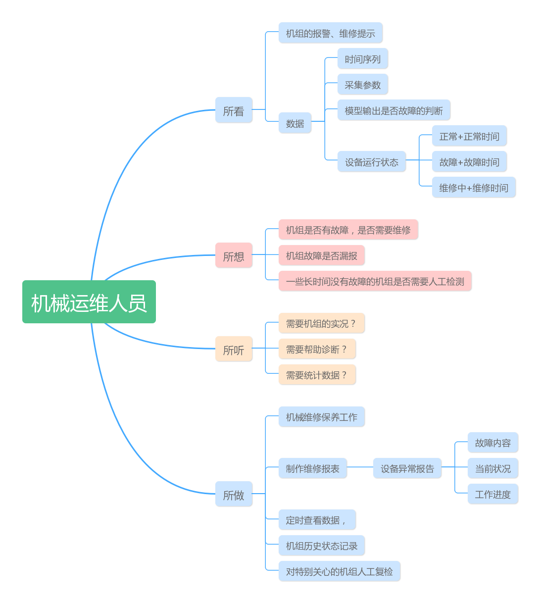
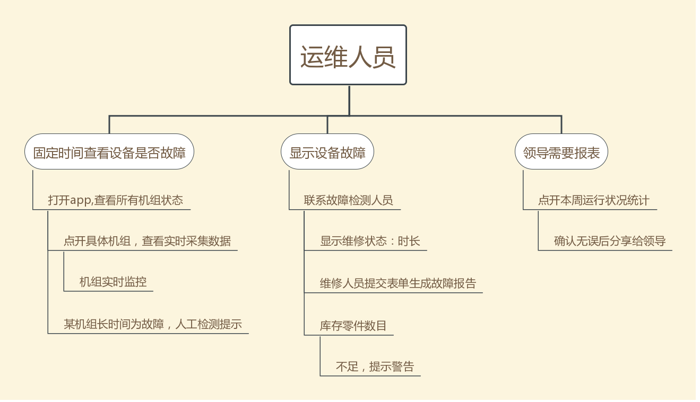
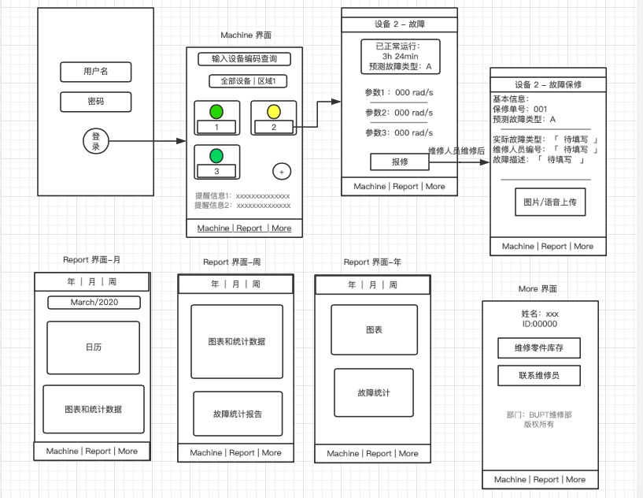
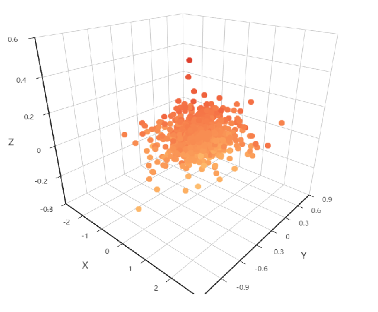
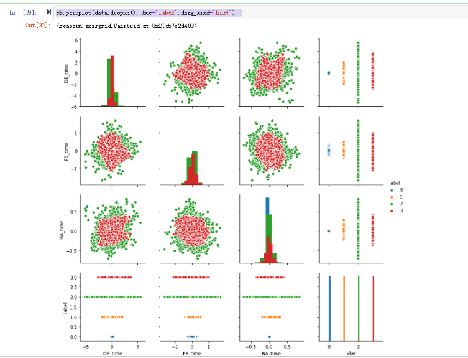
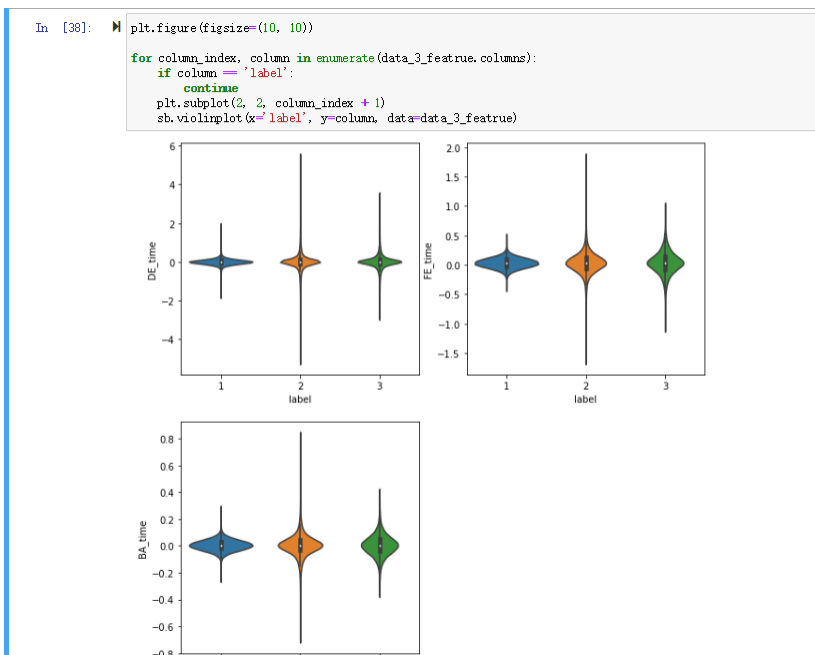
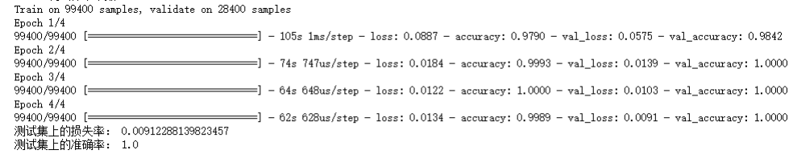

# 工业小程序开发与设计

[](https://github.com/RichardLitt/standard-readme)

Bupt 移动网互联网应用开发课程设计

本仓库主要针对[CWRU轴承故障数据集](https://csegroups.case.edu/bearingdatacenter/home)，进行故障类型的检测，并设计开发一个易于工程人员使用的微信小程序，来辅助他们进行故障的监测与故障原因的判断。

本仓库包含以下内容：

1. 用于进行模型训练的训练集train.csv以及用来测试模型优劣的测试集test.csv。这两个数据集已被压缩在[data.zip](https://github.com/caidongqi/Industrial-Applet)中。
2. 数据预处理和数据可视化的代码[visual.ipython](https://github.com/caidongqi/Industrial-Applet/othercode)以及模型训练的代码[CNN_better.ipython](https://github.com/caidongqi/Industrial-Applet/othercode),还有一个关于这两个文件的一些拓展说明的文档（建议下载后使用WPS查看）。
3. 训练好的预测模型[cwru.model](https://github.com/caidongqi/Industrial-Applet)以及调用模型进行预测的文件[test_code.ipython](https://github.com/caidongqi/Industrial-Applet/code)，可直接按照调用文件中的说明，修改本地参数，对测试数据集test.csv进行故障预测。参考的预测结果已放在[reslut.csv](https://github.com/caidongqi/Industrial-Applet)中。
4. 精美的项目介绍PPT。

## 内容列表

- [小程序设计思路](#小程序设计思路)
	- [用户画像和设计分析](#用户画像和设计分析)
	- [预期实现效果和功能](#预期实现效果和功能)
- [App界面和功能展示](#App界面和功能展示)
- [CWRU数据集预测模型](#CWRU数据集预测模型)
	- [运行环境](#运行环境)
	- [数据可视化分析](#数据可视化分析)
	- [CNN卷积神经网络的搭建](#CNN卷积神经网络的搭建)
	- [模型预测结果展示](#模型预测结果展示)
- [端到端工程实现方案](#端到端工程实现方案)
	- [微信小程序云函数](#微信小程序云函数)
	- [API调用](#API调用)
	- [微信小程序前端设计](#微信小程序前端设计)
	- [微信小程序后端设计](#微信小程序后端设计)
- [相关仓库](#相关仓库)
- [维护者](#维护者)
- [如何贡献](#如何贡献)

## 小程序设计思路
想要做出一个成功的小程序产品，我们首先需要充分地了解我们的受众，经过一系列的调研，我们给出了我们的目标人群`机械运维人员`的用户画像。并分析画出了其用户旅程图。
### 用户画像和设计分析

接着我们根据用户画像合理地推断出用户旅程图，即用户在使用我们的小程序时可能会使用到的流程。

### 预期实现效果和功能
经过上述的分析，我们给出了我们的小程序的原型图。

## APP界面和功能展示

## CWRU数据集预测模型

### 运行环境

这个项目基于[python 3.7](https://www.python.org/)。请确保你本地安装了它们且版本正确，否则可能出现未知的错误。

我们建议你安装[anaconda](https://www.anaconda.com/)来管理不同版本的python以及库文件，并安装 [jupyter notebook](https://jupyter.org/)来方便地运行我们的程序。

此外，本项目依赖的库文件有Tensorflow (1.14.0)和 Keras (2.3.1)，请提前安装好他们。

```sh
pip install tensorflow==1.14.0
pip install keras==2.3.1
```

### 数据可视化分析
首先我们通过调用pychart对CWRU数据集的三个属性：DE-time，FE-time，BA-time进行可视化。我们发现，各类属性之间有着不同的空间分布，即存在着有一定规律的数据的差异，故而我们可以根据已有的数据进行建模找出这个规律，从而对新的数据进行预测。



接着我们对不同类型的数据进行过采样，使得他们的数量大致相同，以便观察。可以看到，不同种类之间，数据之间还是存在较大差异的。



最后画出提琴图，我们可以看到虽然各数据之间，其分布有明显的差异，但是其变化范围几乎重合，这给我们的预测带来了难度。通过单一的一条数据显然是无法获得较好的预测结果的。



### CNN卷积神经网络的搭建
我们的模型是使用卷积神经网络（Convolutional Neural Networks. CNN）训练出来的，想了解其原理的，可以参考[一篇CSDN的博客](https://blog.csdn.net/love__live1/article/details/79481052)，讲的很通俗易懂，关键是画的图十分地形象，推荐刚接触CNN的可以抽空阅读一下。

本次课设中，我们利用keras搭建了一个一维的卷积网络，网络中有20个卷积核，卷积步长为8。使用Relu函数作为激活函数，池化方式选择最大值池化。因为CNN自带卷积特征提取，故`数据预处理`阶段只用进行**加窗处理**。然后取到处理后的1024帧的数据，按照3：6：1的比例划分测试集、训练集和验证集，将训练集的数据作为输入传入网络中进行训练，同时每一轮训练完毕之后，用验证集合查看训练的结果。全部训练结束之后，用测试集来最终确定模型的优良程度。
### 模型预测结果展示

可以看到，CNN的收敛速度很快，且最终的训练效果很棒！
## 端到端工程实现方案
### 微信小程序云函数
### API 调用
### 微信小程序前端设计
### 微信小程序后端设计


`标准 Readme` 最开始因为 [@maxogden](https://github.com/maxogden) 在项目 [feross/standard](https://github.com/feross/standard) 的[这个 

1. 一个定义良好的**规范**。在仓库中的位置是 [spec.md](spec.md)。它是一个一直在持续优化的文档，欢迎您提 Issue 讨论其中的变化。
2. 一个**示例 README**。这个 Readme 完全遵从 Standard-readme，而且在 `example-readmes` 文件夹里有更多的示例。
3. 一个**语法提示器**用来提示在 Readme 中的语法错误。请参考 [tracking issue](https://github.com/RichardLitt/standard-readme/issues/5)。
4. 一个**生成器**用来快速搭建新的 README 的框架。请参考 [generator-standard-readme](https://github.com/RichardLitt/generator-standard-readme)。
5. 一个**标识准守规范的徽章**。请参考

## 安装

这个项目使用 [node](http://nodejs.org) 和 [npm](https://npmjs.com)。请确保你本地安装了它们。

```sh
$ npm install --global standard-readme-spec
```


## 相关仓库

- [Standard Readme](https://github.com/RichardLitt/standard-readme) — 💌 写高质量 README 的艺术。

## 维护者

[@bupt_caidongqi](https://github.com/caidongqi)。

## 如何贡献

非常欢迎你的加入！[提一个 Issue](https://github.com/caidongqi/Industrial-Applet/issues/new) 或者提交一个 Pull Request。


### 贡献者

感谢以下参与项目的人：
