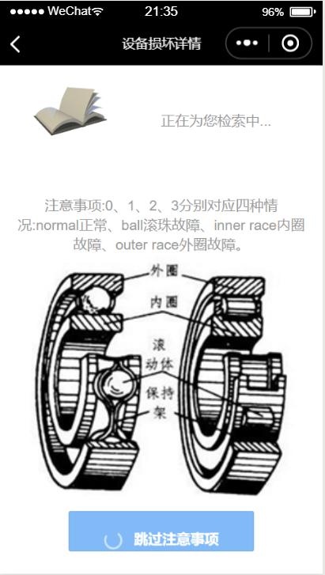
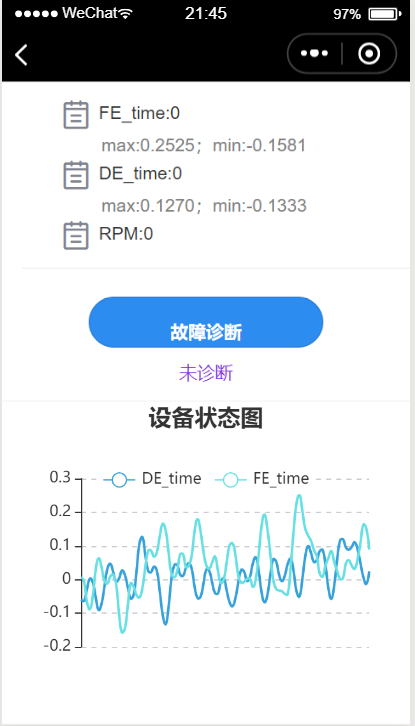
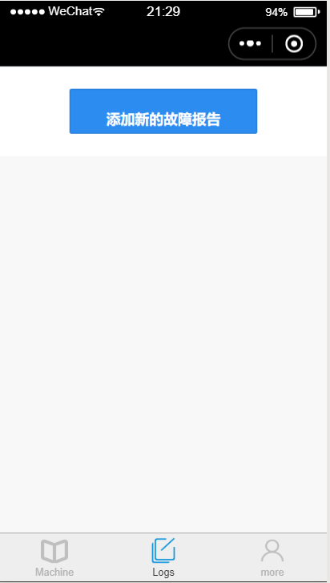
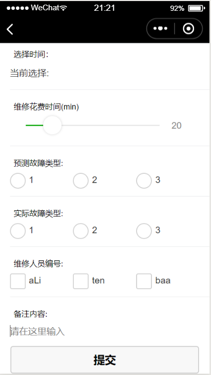
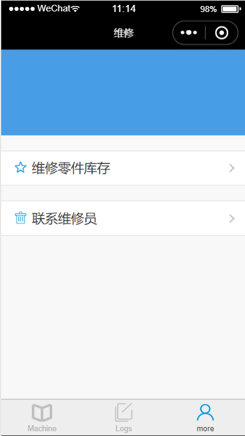
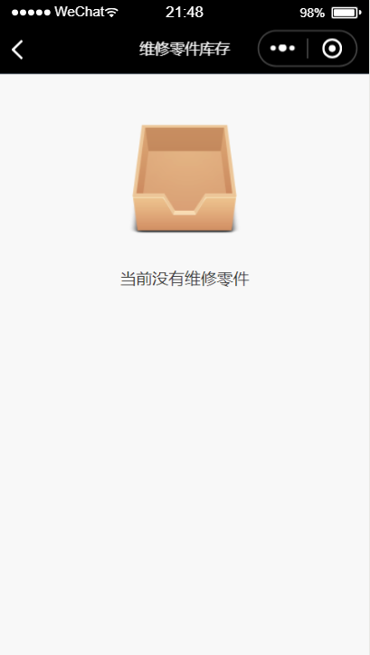
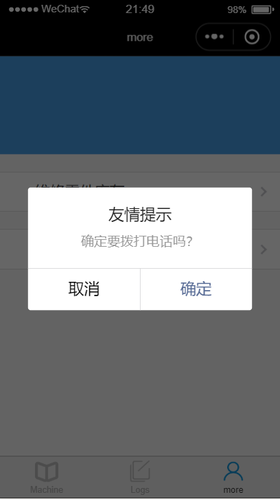
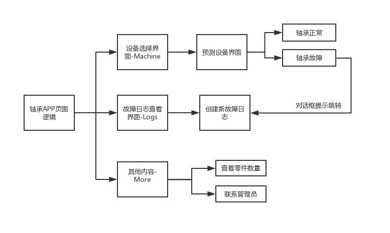

# 基于卷积神经网络的轴承故障诊断方案

[](https://github.com/RichardLitt/standard-readme)

本仓库主要针对[CWRU轴承故障数据集](https://csegroups.case.edu/bearingdatacenter/home)，进行故障类型的检测，并设计开发一个易于工程人员使用的微信小程序，来辅助他们进行故障的监测与故障原因的判断。

本仓库包含以下内容：

1. 用于进行模型训练的训练集train.csv以及用来测试模型优劣的测试集test.csv。这两个数据集已被压缩在[data.zip](https://github.com/caidongqi/Industrial-Applet)中。
2. 数据预处理和数据可视化的代码[visual.ipython](https://github.com/caidongqi/Industrial-Applet/othercode)以及模型训练的代码[CNN_better.ipython](https://github.com/caidongqi/Industrial-Applet/othercode),还有一个关于这两个文件的一些拓展说明的文档（建议下载后使用WPS查看）。
3. 训练好的预测模型[cwru.model](https://github.com/caidongqi/Industrial-Applet)以及调用模型进行预测的文件[test_code.ipython](https://github.com/caidongqi/Industrial-Applet/code)，可直接按照调用文件中的说明，修改本地参数，对测试数据集test.csv进行故障预测。参考的预测结果已放在[reslut.csv](https://github.com/caidongqi/Industrial-Applet)中。
4. 精美的项目介绍PPT。

## 内容列表

- [小程序设计思路](#小程序设计思路)
	- [用户画像和设计分析](#用户画像和设计分析)
	- [预期实现效果和功能](#预期实现效果和功能)
- [App界面和功能展示](#App界面和功能展示)
- [CWRU数据集预测模型](#CWRU数据集预测模型)
	- [运行环境](#运行环境)
	- [数据可视化分析](#数据可视化分析)
	- [CNN卷积神经网络的搭建](#CNN卷积神经网络的搭建)
	- [模型预测结果展示](#模型预测结果展示)
- [端到端工程实现方案](#端到端工程实现方案)
	- [微信小程序云函数](#微信小程序云函数)
	- [API调用](#API调用)
	- [微信小程序前端设计](#微信小程序前端设计)
	- [微信小程序后端设计](#微信小程序后端设计)
- [相关仓库](#相关仓库)
- [维护者](#维护者)
- [如何贡献](#如何贡献)

## 小程序设计思路
想要做出一个成功的小程序产品，我们首先需要充分地了解我们的受众，经过一系列的调研，我们给出了我们的目标人群`机械运维人员`的用户画像。并分析画出了其用户旅程图。
### 用户画像和设计分析

接着我们根据用户画像合理地推断出用户旅程图，即用户在使用我们的小程序时可能会使用到的流程。

### 预期实现效果和功能
经过上述的分析，我们给出了我们的小程序的原型图。

## APP界面和功能展示
1. app共三个主界面Macine、Logs、more

2. Machine负责查询某个设备的具体故障信息，由设备参数、故障类型及设备状态曲线图组成





3. Logs负责用户实时提交表单，便于查看和统计




4. more负责附加功能，展示维修零件库存和联系维修员





## CWRU数据集预测模型

### 运行环境

这个项目基于[python 3.7](https://www.python.org/)。请确保你本地安装了它们且版本正确，否则可能出现未知的错误。

我们建议你安装[anaconda](https://www.anaconda.com/)来管理不同版本的python以及库文件，并安装 [jupyter notebook](https://jupyter.org/)来方便地运行我们的程序。

此外，本项目依赖的库文件有Tensorflow (1.14.0)和 Keras (2.3.1)，请提前安装好他们。

```sh
pip install tensorflow==1.14.0
pip install keras==2.3.1
```

### 数据可视化分析
首先我们通过调用pychart对CWRU数据集的三个属性：DE-time，FE-time，BA-time进行可视化。我们发现，各类属性之间有着不同的空间分布，即存在着有一定规律的数据的差异，故而我们可以根据已有的数据进行建模找出这个规律，从而对新的数据进行预测。


接着我们对不同类型的数据进行过采样，使得他们的数量大致相同，以便观察。可以看到，不同种类之间，数据之间还是存在较大差异的。


最后画出提琴图，我们可以看到虽然各数据之间，其分布有明显的差异，但是其变化范围几乎重合，这给我们的预测带来了难度。通过单一的一条数据显然是无法获得较好的预测结果的。


### CNN卷积神经网络的搭建
我们的模型是使用卷积神经网络（Convolutional Neural Networks. CNN）训练出来的，想了解其原理的，可以参考[一篇CSDN的博客](https://blog.csdn.net/love__live1/article/details/79481052)，讲的很通俗易懂，关键是画的图十分地形象，推荐刚接触CNN的可以抽空阅读一下。

下面是模型建立的核心代码：
```sh
x_train, x_valid, x_test = x_train[:,:,np.newaxis], x_valid[:,:,np.newaxis], x_test[:,:,np.newaxis]   #如果使用两个特征，则注释这一行

# 输入数据的维度
input_shape =x_train.shape[1:]
# 实例化一个Sequential
model = Sequential()

#第一层卷积
model.add(Conv1D(filters=64, kernel_size=20, strides=8, padding='same',kernel_regularizer=l2(1e-4), input_shape=input_shape))
model.add(BatchNormalization())
model.add(Activation('relu'))
model.add(MaxPooling1D(pool_size=4, strides=4, padding='valid'))


# 从卷积到全连接需要展平
model.add(Flatten())

# 添加全连接层
model.add(Dense(units=100, activation='relu', kernel_regularizer=l2(1e-4)))
# 增加输出层，共num_classes个单元
model.add(Dense(units=num_classes, activation='softmax', kernel_regularizer=l2(1e-4)))


# 编译模型
model.compile(optimizer='Adam', loss='categorical_crossentropy',
              metrics=['accuracy'])

# TensorBoard调用查看一下训练情况
tb_cb = TensorBoard(log_dir='logs/{}'.format(model_name))

# 开始模型训练
model.fit(x=x_train, y=y_train, batch_size=batch_size, epochs=epochs,
          verbose=1, validation_data=(x_valid, y_valid), shuffle=True,
          callbacks=[tb_cb])

# 评估模型
score = model.evaluate(x=x_test, y=y_test, verbose=0)
print("测试集上的损失率：", score[0])
print("测试集上的准确率：", score[1])
# plot_model(model=model, to_file='cnn-1D.png', show_shapes=True)
```

本次实验中，我们利用keras搭建了一个一维的卷积网络，网络中有20个卷积核，卷积步长为8。使用Relu函数作为激活函数，池化方式选择最大值池化。因为CNN自带卷积特征提取，故`数据预处理`阶段只用进行**加窗处理**。然后取到处理后的1024帧的数据，按照3：6：1的比例划分测试集、训练集和验证集，将训练集的数据作为输入传入网络中进行训练，同时每一轮训练完毕之后，用验证集合查看训练的结果。全部训练结束之后，用测试集来最终确定模型的优良程度。
### 模型预测结果展示

可以看到，CNN的收敛速度很快，且最终的训练效果很棒！
## 端到端工程实现方案

### API 调用
调用API获得诊断结果分为两步：首先根据数据集文件名获得特征提取的文件名，然后将特征提取的文件名作为参数，在平台上运行代码获得最终结果。考虑到wx.request是异步运行，所以不能将两个wx.request请求顺序写入，此时需要运用到回调机制，类似于两个wx.request嵌套。获得诊断结果后，对结果进行显示。
### 微信小程序前端设计
1. 根据设计出的小程序原型图，在app.json文件中设计总体板块样式
2. 在pages文件夹创建不同的子文件夹，不同的子文件夹对应不同的页面
3. 运用微信开发者工具提供的官方文档中的函数和模块实现功能
4. 对小程序的美观性进行润色，分别针对每个wxss文件进行设计
### 微信小程序后端设计

1. 首先在Machine界面选择一个设备，对设备的内容进行查看。
2. 数据展示:由于只有四个设备，在云开发控制台上部署好需要展示的数据集：test0，test1,test2,test3。（report是Logs页面获取表单数据用）。写好获取数据集的云函数cloudfun(函数名）：云函数根据设备的编号（0，1，2，3）获取需要的集合。这些数据需要在打开页面时同时取得，将调用云函数cloudfun取得的数据集合赋值给预先设置好的变量中。
3. 获取设备数据后，使用列表渲染显示界面中。导入echarts官方给出的组件，接着在json文件中写明导入的组件，然后使用echarts包中组件ec-canvas，将数据绑定该组件，最后在js文件中写入折线图的画函数。
4. 对故障进行诊断调用API。
5. 如果故障诊断为设备故障，弹出对话框。那么会弹出对话框，显示是否跳转到新建日志文件。为了简化开发，使用了[iView Weapp](https://weapp.iviewui.com/docs/guide/start) 开发的组件。在wxml文件中写入i-modal组件，将组件的页面跳转功能写在handleClick函数中。在第二个wx.request回调中判断是否故障，如果故障，则弹出对话框，对话框的功能设置在handleClick中。
6. 表单填写:获取表单集合数据在logs界面中，需要展示以前填写过的表单。这些表单存储在微信云平台上的一个数据集中，需要调用云函数的功能调用，由于每次显示该界面都需要刷新显示，所以将从云平台获取表单数据的代码写入onShow函数中。获取数据后将表单数据集绑定在iView Weapp提供的i-card组件显示即可。i-card组件们使用List排版。详情参考iView Weapp官方开发文档。
7. 在wxml文件中写入一系列input组件，将‘提交’button设置属性为’submit’，绑定一个事件：该事件函数的功能为提交表单的内容到微信云开发平台的一个预先设置好的集合中。

## 相关仓库

- [Standard Readme](https://github.com/RichardLitt/standard-readme) — 💌 写高质量 README 的艺术。

## 维护者

[@bupt_caidongqi](https://github.com/caidongqi)。

## 如何贡献

非常欢迎你的加入！[提一个 Issue](https://github.com/caidongqi/Industrial-Applet/issues/new) 或者提交一个 Pull Request。


### 贡献者

感谢以下参与项目的人：
